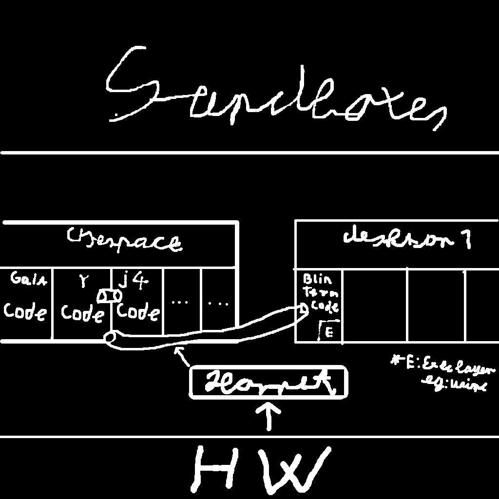

# The design of the RoidsOS kernel(h0r.net)
Note: since typing h0r.net is hard and takes a long time, I will drop the stylization and just type Hornet. 
## 1. Kernel architecture
### 1.2 General Architecture
Hornet is a `hybrid kernel`, allowing for drivers to run in `Kernelspace` or in `Userspace`.


## 2. Registery
### 2.1 Terminology
1. `hive`: The biggest unit of registery.
1. `key`: It is like a directory.
1. `entry`: A single value.

### 2.2 Entry Types
1. `0x0`: `I8`: 8 bit signed integer.
1. `0x1`: `I16`: 16 bit signed integer.
1. `0x2`: `I32`: 32 bit signed integer.
1. `0x3`: `I64`: 64 bit signed integer.
1. `0x4`: `U8`: 8 bit unsigned integer.
1. `0x5`: `U16`: 16 bit unsigned integer.
1. `0x6`: `U32`: 32 bit unsigned integer.
1. `0x7`: `U64`: 64 bit unsigned integer.
1. `0x8`: `BOOL`: A boolean.
1. `0x9`: `CHAR`: A utf-8 character, it is 8 bits wide.
1. `0xA`: `WCHAR`: A utf-16 character, it is 16 bits wide.
1. `0xB`: `SZ`: A string in the system's preferred encoding, zero-terminated.
1. `0xC`: `FLOAT`: A 32-bit floating point number.
1. `0xD`: `DOUBLE`: A 64-bit floating point number.
### 2.3 Structure
there are `3` hives:

- `SYSTEM`
- `USER`
- `HARDWARE`

`SYSTEM` is for the main system. It contains the main configuration of the OS.

`USER` is for programs. It contains information about the installed programs, their version, the users that own them, etc.

`HARDWARE` is for hardware configuration.

#### A `hive` file header:
Header:
```c
typedef struct {
    uint32_t magic;   // a magic value(0xB16B00B5)
    uint32_t num_keys;// the number of keys in the file
    uint8_t checksum; // a checksum that makes all bytes add up to 0x00
    char name[64];    // the name of the hive
} hive_header;

```
After the header comes `num_keys` key fields.
#### A `key` field
Header:
```c
typedef struct {
    uint32_t magic;         // magic number(0x69420666)
    uint32_t num_entries;   // the number of entries
    uint32_t num_subkeys;   // the number of subkeys
    char name[64];          // the name of the key
} key_header;
```
After the header comes `num_entries` entry fields, and `num_subkeys` keys after that.
#### An `entry` field
Header:
```c
typedef struct {
    char name[64]; // The name of the entry
    uint8_t type;   // The type of the entry.
    uint8_t length; // The length of the entry not including the header.
} entry_header;
``` 
After that comes `length` bytes of data.

#### 3.4 Accessing the registery

The registery hives are on hard disk in form of `.reg` files.

Accessing the registery is done through the `reg_mount` syscall that mounts a hive to the VFS, where it can be traversed.

Each key gets turned into a directory, and each entry gets turned into a file.
## 3. Initialization
Hornet has a built in init system named `wakeup`. Its role is to start up the `Kernel space` of RoidsOS, find the drive it booted from, and load the `SYSTEM` and `HARDWARE` hives. It is also responable for loading the following:
1. `Kernel modules`: Special executables that are run in `Kernel` or `Driver` space.
1. `Drivers` Executables that can export system functions, callable by any process.

#### 3.1 Paths
1. `SYSTEM` hive: `/sys/reg/system.reg`
1. `HARDWARE` hive: `/sys/reg/hardware.reg`
### 3.1 Gaia
Gaia is the first process that gets started on boot. It is responsible completing all startup tasks.
### 3.2 Configurations
Configurations are entries in key `sys_config` in the `SYSTEM` hive:
1. `boot_id`(`SZ`): the ID of this installation that lets h0r.net distinguish between different installations.
1. `sys_shell`(`SZ`): path to the shell that is used by the system.
1. `startup_group`(`SZ`): The ID of the startup group that gets started on boot.

### 3.3 Startup objects
#### 3.3.1 Startup groups
`Startup group`s are subkeys of key `startup/tasks` in the `SYSTEM` hive.

Here is what entries in the key do:
1. `id`(`SZ`): The ID of the group.
1. `post_exec`(`SZ`,***optional***): The command that gets called after all the subgroups are done running.

#### 3.3.2 Startup tasks
`Startup task`s are subkeys of a `Startup group` in the `SYSTEM` hive.

Here is what entries in the key do:
1. `id`(`SZ`): The identifier of the service. 
1. `name`(`SZ`,***optional***): Human friendly name of the service, useful for viewing with GUI tools.
1. `desc`(`SZ`,***optional***): Human friendly description of the service, useful for viewing with GUI tools. 
1. `exec`(`SZ`): The command that gets executed when the service is called, plus the arguments it takes, separated by spaces.
1. `root`(`BOOL`): Whether to run it as root, or the currently logged in user.
1. **All other entries are treated as custom parameters.**

## 4. Filesystem
Hornet has an indexed VFS that abstracts FS operations. There is also a translation layer in the executive layer that transforms the paths to the VFS's syntax from the Sandbox's internal syntax.
### 4.1 Drives
TBA.
### 4.2 VFS syntax
Here are the rules of Hornet's **internal** VFS path syntax:
1. we use `slashes` to separate directories, **not** backslashes.
1. there **never** is a leading slash, traditional `"relative paths"` do not exist.
1. there are **no** trailing slashes allowed.
1. the `\b` character is used as an escape character.
1. the `\b?` escape sequence is used to match a single character.
1. the `\b*` escape sequence is used to match any number of characters.
## 5. Processes and the userspace
RoidsOS is a multitasking system, Hornet can schedule processes.
### 5.1 Process states
there are 4 process states in Hornet:
1. `nonexistant`: The process slot is not occupied.
1. `ready`: The process can be scheduled without problem.  
1. `blocked`: The process is blocked and shouldn't be scheduled.
1. `dead`: The process has been killed or exited and must be cleaned up.
### 5.2 System calls
the naming convention for system calls is `sys_` followed by the name of the subsystem, then the name of the function.

Here are all Hornet syscalls:

0. `sys_proc_exit`: Exits from the current process.(`RBX`=`exit code`)
1. `sys_proc_kill`: Kills a process.(`RBX`=`process ID`,`RCX`=`fake exit code`)
1. `sys_tty_write`: Writes to the console.(`RBX`=`character`)
1. `sys_tty_read`: Reads from the console.(`return value`=`character`)
1. `sys_vfs_open`: Opens a file.(`RBX`=`file path`,`RCX`=`pointer to the file ID`)
1. `sys_vfs_close`: Closes a file.(`RBX`=`file ID`)
1. `sys_vfs_read`: Reads from an **opened** file.(`RBX`=`file ID`, `RCX`=`offset`,`RDX`=`value pointer`)
1. `sys_vfs_write`: Writes to an **opened** file.(`RBX`=`file ID`, `RCX`=`offset`,`RDX`=`value`)
1. `sys_vfs_create`: Creates a file or directory.(`RBX`=`file path`,`RCX`=`recursive?`,`RDX`=`directory?`)
1. `sys_vfs_delete`: Deletes a file or directory.(`RBX`=`file path`)
1. `sys_vfs_modify`: Modifies a file or directory.(`RBX`=`file ID`,`RCX`=`field ID`,`RDX`=`value`)
1. `sys_event_create`: Creates an event.(`return value`=`event ID`)
1. `sys_event_destroy`: Destroys an event.(`RBX`=`event ID`)
1. `sys_event_subscribe`: Subscribes to an event.(`RBX`=`event ID`,`RCX`=`callback`)
1. `sys_event_unsubscribe`: Unsubscribes from an event.(`RBX`=`event ID`)
1. `sys_event_fire`: Fires an event.(`RBX`=`event ID`,`RCX`=`data`)
1. `sys_reg_create`: Creates a hive.(`RBX`=`hive name`,`return value`=`hive ID`)
1. `sys_reg_load`: Loads a hive from disk.(`RBX`=`hive ID`,`RCX`=`path`)
1. `sys_reg_save`: Saves a hive to disk.(`RBX`=`hive ID`,`RCX`=`path`)
1. `sys_reg_mount`: Mounts a hive.(`RBX`=`hive ID`,`return value`=`drive ID`)

TODO: add more

## 6.Event system
In Hornet, events are a way of communicating between processes. They are kinda like UNIX signals.(IDK what unix signals are like)
### 6.1 Event objects
Event objects can be created with the `sys_event_create` syscall. The `sys_event_destroy` syscall is used to destroy them. An event object has a list of subscribers, and their callbacks. An event can be fired with the `sys_event_fire` syscall. 
### 6.2 Subscribers
A process can subscribe to an event by calling the `sys_event_subscribe` syscall, and unsubscribe by calling `sys_event_unsubscribe`.

`sys_event_subscribe` takes 2 arguments: `id` and `callback`. `id` is the ID of the event, and `callback` is the function that gets called when the event is fired.An event callback must take 2 arguments: `id` and `data`. `id` is the ID of the event, and `data` is the data that it recieves.
```c
void callback(usize id, void* data);
```
At the end of the callbach function there must be a `sys_event_end` syscall, which takes `success`(`BOOL`) as an argument. `success` is whether the event was fired successfully.

# 7. Drivers
There are `3` types of drivers:
1. **Mandatory drivers**: These are baked into the kernel and a fault usually results in a kernel panic.
1. **Kernelspace drivers**: These are overhead sensitive drivers(eg. Graphics,Sound,Network) that are less secure than `Userspace drivers`.
1. **Userspace drivers**: These are overhead insensitive drivers(eg. Storage) that are more secure than `Kernelspace drivers`.
## 7.1 Mandatory drivers
Mandatory drivers are baked into the kernel, they are in either `drivers/` or `arch/${ARCH}/drivers/`. they do not use any driver interface and are free to use any function in the kernel. they have a `<name>_init` function that gets called on boot, and must return `true` on success.

## 7.2 Kernelspace drivers
Kernelspace drivers use UDI.

## 7.3 Userspace drivers
Userspace drivers use UDI.
